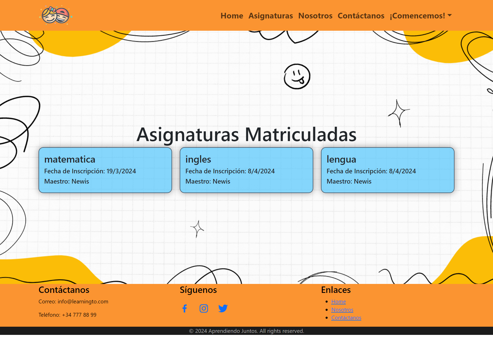
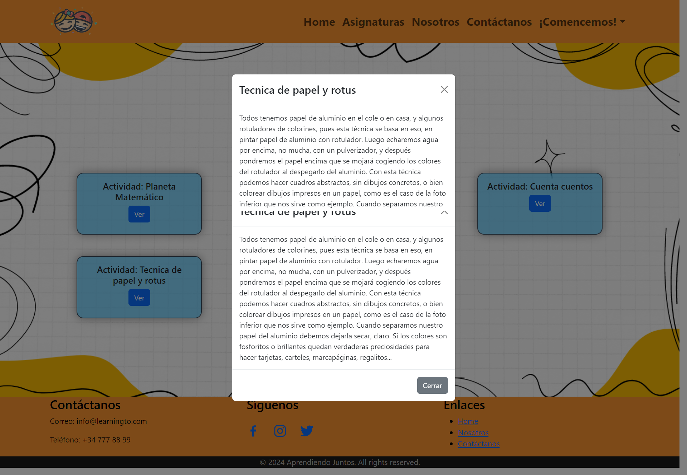
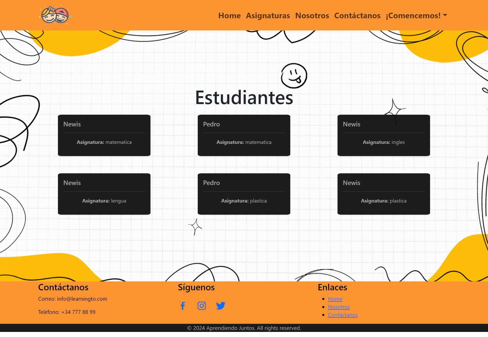

<h1 align="center">✏️ Frontend - Aprendiendo Juntos 🤓</h1>

<div style="text-align: center;"></div>

<details>
  <summary>Contenido 📝</summary>
<ol>
  <li><a href="#Objetivo">Objetivo</a></li>
  <li><a href="#Características">Características</a></li> 
  <li><a href="#Tecnologías utilizadas">Tecnologías utilizadas</a></li>
  <li><a href="#Instrucciones de Instalación">Instrucciones de Instalación</a></li>
  <li><a href="#Agradecimientos">Agradecimientos</a></li>
  <li><a href="#Contacto ">Contacto </a></li>
</ol>
</details>

## Objetivo

El objetivo de este proyecto es crear una plataforma educativa interactiva y personalizada que brinde a los usuarios una experiencia enriquecedora de aprendizaje. La plataforma estará diseñada para ofrecer actividades adaptadas a las necesidades individuales de los estudiantes, con funciones para el seguimiento del progreso, la interacción entre usuarios y la gestión eficiente del contenido educativo. 
El objetivo principal es brindar un ambiente seguro y divertido donde los niños puedan aprender, crecer y desarrollar sus habilidades de manera significativa.

## Características
<details>
<summary>Características de Usuario</summary>
 🔐 Registro sin problemas: los usuarios pueden registrarse sin esfuerzo e ingresar sus datos para configurar una cuenta.

<p align="center">
  
</p>

 🔑 Iniciar sesión: acceda fácilmente a su cuenta a través de un procedimiento de inicio de sesión fácil de usar, lo que garantiza un acceso rápido y conveniente a todas las funcionalidades.

<p align="center">
  
</p>

 📝 Edición del perfil de usuario: ¿Cometió un error durante el registro? No temas, los usuarios tienen el poder de modificar su información sin problemas cuando lo deseen.

<p align="center">
  
</p>

📚​Explore asignaturas extraordinarias: disfrute de nuestra selección de actividades.

<p align="center">
  
</p>

✏️ Gestión de actividades: ...

<p align="center">
  
</p>


</details>
<details>
<summary>Características de Maestros</summary>

 📝 Gestión de estudiantes: el api les permitira a los maestros gestionar las incripciones y saber en todo momento, la cantidad de estudiantes que tiene por materia.

<p align="center">
  
</p>


</details>
<details>
<summary>Características del Superadmin</summary>

 👤 Gestión de usuarios: empoderar al superadministrador con una supervisión integral, permitiéndole navegar sin problemas a través de todos los perfiles de usuario y administrar de manera eficiente las cuentas de usuario, incluida la capacidad de eliminar usuarios y asignaturas cuando sea necesario.

<p align="center">
  
</p>

<p align="center">
  
</p>

</details>

## Tecnologías utilizadas

<p align="left"> <a href="https://www.w3schools.com/css/" target="_blank" rel="noreferrer">  </a> <a href="https://git-scm.com/" target="_blank" rel="noreferrer">  </a> <a href="https://www.w3.org/html/" target="_blank" rel="noreferrer">  </a> <a href="https://developer.mozilla.org/en-US/docs/Web/JavaScript" target="_blank" rel="noreferrer">  </a> <a href="https://www.mysql.com/" target="_blank" rel="noreferrer">  </a>  <a href="https://reactjs.org/" target="_blank" rel="noreferrer">  </a> <a href="https://redux.js.org" target="_blank" rel="noreferrer">  </a>  <a target="_blank" rel="noopener noreferrer" href="https://github.com/devicons/devicon/blob/master/icons/git/git-original.svg"></a>
<a target="_blank" rel="noopener noreferrer" href="https://github.com/devicons/devicon/blob/master/icons/bootstrap/bootstrap-plain.svg"></a 
</p>

## Instrucciones de instalación

1. **Clonar el repositorio:**

   ```bash
   git clone https://github.com/pedrowolfr/Frontend_AprendiendoJuntos.git
   cd frontend-aprendiendo
   ```

2. **Instalar dependencias frontend:**

   ```bash
   npm install
   ```

3. **Configurar el Backend:**

   - Comience creando una base de datos MySQL.
   - Siga las instrucciones de instalación del backend proporcionadas en el [Backend App - Aprendiendo Juntos](https://github.com/pedrowolfr/Backend_AprendiendoJuntos.git).

4. **Instalar dependencias de backend:**

   ```bash
   npm install
   ```

5. **Iniciar la aplicación:**
   - Navegue hasta el directorio frontend y ejecute `npm run dev` para iniciar la interfaz.
   - De manera similar, en el directorio backend, ejecute `npm run dev` para iniciar el servidor backend.

La aplicación será accesible a través de [http://localhost:5173/](http://localhost:5173/) para la interfaz y [http://localhost:3000/](http://localhost:3000/) para el backend.

## Agradecimientos

Este proyecto ha sido posible gracias a todos los que hacen vida en **GeekHubs Academy**, quienes compartieron sus conocimientos con estusiasmo y mucha dedicación, durante esta etapa de aprendizaje que aun no termina, ademas a mis compañeros, por el apoyo incondicional y muy paciente.:

- **GeekHubs Academy** 
<a href="https://geekshubsacademy.com/" target="_blank"></a>

- **Gabriel Escudillo**  
<a href="https://github.com/GabrielEscudillo" target="_blank"></a> 

- **Erika Orlando**  
<a href="https://github.com/AkireOrl" target="_blank"></a>

## Autor

- **Pedro Rondón**

## Contacto   
<a href = "mailto:pedro.rondonx@gmail.com"  target="_blank">

</a>
<a href="https://github.com/pedrowolfr"  target="_blank">
    
</a>  
<a href="https://www.linkedin.com/in/pedro-rond%C3%B3n-leon-1224ba168/" target="_blank">

</a> 

[](#) 